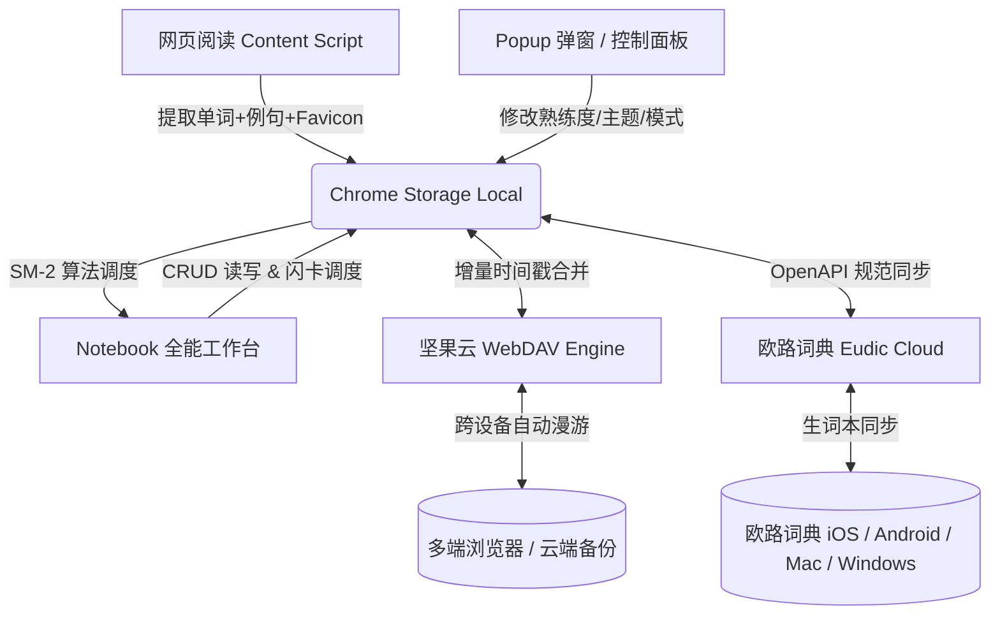

# 🍎 Antigravity - 专为外刊深度阅读定制的极简划词与全能生词本神器

<div align="center">


<br/>

**极简 · 高雅 · 纯粹 · 跨端漫游**  
*融合 Claude 暖色纸质美学与权威外刊排版，结合 SM-2 艾宾浩斯间隔记忆算法，构建从「网页沉浸阅读」到「多端永久内化」的全链路生词学习闭环。*

[🚀 快速开始](#-快速安装与启动) • [✨ 核心功能矩阵](#-核心功能矩阵) • [💼 职场摸鱼模式](#-职场专注双模隐形复习) • [☁️ 云同步配置](#-多端漫游与云同步配置) • [⌨️ 快捷键速查](#%EF%B8%8F-快捷键速查表) • [🗺️ 产品路线图](#%EF%B8%8F-产品演进路线图)

</div>

---

## 💡 产品定位与设计哲学

在阅读 *The Wall Street Journal*、*The Financial Times*、*The Economist*、*The New York Times* 或 *Nature* 等深度长文时，传统的查词工具往往存在三大核心痛点：
1. **破坏阅读心流**：臃肿的弹窗、冗长混乱的释义、花哨的广告分散了对文章逻辑的思考；
2. **割裂语境沉淀**：仅机械地保存孤立单词，丢失了词汇在原文中精妙的地道表达与例句；
3. **数据孤岛与复习脱节**：生词堆积在浏览器本地，无法轻松漫游至手机端（如欧路词典），缺乏科学的复习算法驱动。

**Antigravity 的诞生就是为了彻底解决以上问题：**
- **以语境为核心**：不仅收录单词，更自动提取权威外刊的原汁例句、来源网站 Favicon 与文章标题，原汁原味还原阅读现场。
- **以记忆为导向**：引入经典 SuperMemo SM-2 算法与间隔重复（SRS），提供卡片翻转、熟练度盲打自测与智能复习调度。
- **以隐私为底线**：坚持 **Local-First（本地优先）** 原则，不搭建任何第三方收集服务器，所有词库仅保存在本地及用户私有的坚果云 WebDAV / 欧路词典云端。

---

## ✨ 核心功能矩阵

### 1. 📰 沉浸式外刊划词与智能语境捕获
- **极速响应**：网页中双击单词或鼠标划选短语，右上方即时悬浮优雅微卡，毫秒级呈现双语音标与精简释义。
- **智能语境例句提取**：自动截取当前段落/句子，智能识别单词的所有屈折变化（复数、时态、分词、所有格）并在原句中精美加粗高亮。
- **主流外刊来源徽标**：内置 WSJ、FT、Economist、Bloomberg、Reuters、NYT、Nature、Wired、Substack 等权威站点 Favicon 映射引擎。
- **释义智能净化与分行**：自动过滤人名杂质翻译，智能识别 `vt.`、`vi.`、`n.`、`adj.`、`adv.` 等词性并规范分行呈现。

### 2. 📋 Claude 纸质美学全能笔记本工作台
- **典雅排版**：英文字体采用报刊衬线体（Charter / Georgia），中文字体采用高清苹方（PingFang SC），提供极致阅读舒适度。
- **深浅与暗黑模式全覆盖**：支持跟随系统（System Auto）、经典暖纸浅色（Light Mode）以及护眼黑色模式（Dark Mode）。
- **统一功能菜单（Menu）**：优雅整合外观切换、JSON 词库导出与坚果云 WebDAV 同步设置，界面极简克制。
- **行内无损修改**：支持在笔记本列表中直接双击或点击编辑单词、音标、释义、例句与笔记，编辑已存在单词时保持原序不变，新增词汇自动置顶。
- **真人级发音点读**：内置原生 Web Speech API 纯正英美音点读，支持一键点击朗读与快捷键发音。

### 3. 🎴 艾宾浩斯自适应记忆闪卡
- **SM-2 间隔记忆算法**：根据 0~3 级熟练度（🔴生疏待背 / 🟠初识阶段 / 🔵巩固阶段 / 🟢熟练掌握）动态计算复习优先级与记忆间隔。
- **长效均衡调度**：优化防局部过载算法，兼顾新近加入生词与早期生疏词汇，告别“只复习最新词”的算法偏差。
- **翻转自测与全键盘盲打**：支持空格翻转正面/背面，数字键 `1` / `2` / `3` 极速评级，`R` 键真人发音，全程双手不离键盘。

### 4. 💼 职场专注：双模隐形复习（摸鱼模式）
- **💻 VS Code 代码编辑器皮肤**：一键将生词本伪装成真实的 VS Code 界面，单词化身为 TypeScript 接口与代码注释，工作间隙背单词神不知鬼不觉。
- **📧 Outlook 办公邮件皮肤**：瞬间切换为企业邮箱界面，生词转化为邮件主题、发件人与正文，无缝融入办公场景。

### 5. ☁️ 全生命周期多端漫游与双向同步
- **坚果云 WebDAV 深度融合**：
  - 基于增量时间戳与客户端合并算法，实现防冲突、多设备自动静默双向同步。
  - 顶部融合状态胶囊实时指示同步状态（🟢已就绪 / 🔄同步中 / ⚪未同步），支持点击一键强制拉取刷新。
- **欧路词典 (Eudic) OpenAPI 双向联动**：
  - 支持全部分类生词本双向拉取与智能去重合并。
  - 真正实现“电脑外刊划词，手机欧路词典随时随地背”。
- **标准开放数据**：一键导出标准格式 JSON 词库，便于导入 Anki 或制作 Excel 闪卡。

---

## 🚀 快速安装与启动

### 方式一：下载预打包安装包（推荐）
1. **[📥 点击下载 Antigravity-v1.0.0-ChromeExtension.zip](https://github.com/bohemianer/antigravity/raw/main/Antigravity-v1.0.0-ChromeExtension.zip)** 并解压到本地文件夹；
2. 打开 Chrome / Edge / Brave / Arc 浏览器，在地址栏输入：
   ```text
   chrome://extensions/
   ```
3. 开启右上角的 **「开发者模式 (Developer mode)」**；
4. 点击左上角 **「加载已解压的扩展程序 (Load unpacked)」**；
5. 选择解压出的 `AntigravityVocabExtension` 文件夹，即可完成安装！

### 方式二：开发者 Git 源码克隆
```bash
git clone https://github.com/bohemianer/antigravity.git
cd antigravity
# 在浏览器扩展页面加载当前目录即可
```

---

## ☁️ 多端漫游与云同步配置

### 1. 坚果云 WebDAV 同步配置（推荐）
1. 登录 [坚果云官网 (jianguoyun.com)](https://www.jianguoyun.com)；
2. 进入 **「账户信息」** ➔ **「安全设置」** ➔ **「第三方应用管理」**；
3. 点击 **「添加应用」**，名称填写 `Antigravity`，生成专属应用密码；
4. 打开 Antigravity 笔记本页面，点击右上角 **「菜单 ➔ 坚果云同步设置」**（或直接点击顶部状态胶囊）：
   - **服务器地址**：`https://dav.jianguoyun.com/dav/`
   - **账户**：您的坚果云注册邮箱
   - **应用密码**：生成的专属应用密码
5. 点击 **「保存并测试连接」**，状态胶囊显示绿色即代表云端漫游已就绪！

### 2. 欧路词典 (Eudic) OpenAPI 配置
1. 访问 [欧路词典开放平台 (open.eudic.net)](https://open.eudic.net) 登录个人账号；
2. 申请并获取个人 **授权 Token**；
3. 在 Antigravity 同步设置面板中填入 Token，点击 **「从欧路词典拉取合并」**，即可将欧路生词本全量导入！

---

## ⌨️ 快捷键速查表

| 场景 | 快捷键 | 功能说明 |
| :--- | :---: | :--- |
| **网页阅读** | `双击单词` | 触发悬浮释义与语境捕获面板 |
| **网页阅读** | `鼠标划选` | 触发多词短语/专业术语查询 |
| **闪卡自测** | <kbd>Space</kbd> / <kbd>Enter</kbd> | 翻转卡片（查看/隐藏释义与例句） |
| **闪卡自测** | <kbd>1</kbd> | 标记为「🔴 生疏待背」（重置复习周期） |
| **闪卡自测** | <kbd>2</kbd> | 标记为「🟠 模糊初识」（推进至下一阶段） |
| **闪卡自测** | <kbd>3</kbd> | 标记为「🟢 熟练掌握」（延长记忆间隔） |
| **闪卡自测** | <kbd>R</kbd> | 真人语音点读当前生词 |
| **闪卡自测** | <kbd>→</kbd> / <kbd>←</kbd> | 切换上一张 / 下一张闪卡 |
| **笔记本列表** | <kbd>/</kbd> | 快速聚焦顶部搜索框 |

---

## 🏗️ 技术架构与工程实现



- **Runtime**：Chrome Manifest V3 (Service Worker + Content Scripts)
- **UI & Styling**：原生 Vanilla JavaScript (ES2022+)，0 第三方重型框架依赖，CSS Variables 主题引擎，毫秒级轻快加载
- **WebDAV Client**：自主实现轻量级 XML Propfind & Put 请求，支持断点自动重试与版本冲突校验
- **Memory Engine**：适配化 SuperMemo-2 间隔重复算法模型

---

## 🗺️ 产品演进路线图

- [x] **v1.0.0 (当前版本)**
  - [x] 外刊沉浸划词与智能语境例句捕获
  - [x] 经典 Claude 暖色美学与全功能笔记本
  - [x] SM-2 艾宾浩斯自测闪卡系统与均衡算法
  - [x] VS Code / Outlook 双模职场摸鱼复习皮肤
  - [x] 全暗黑模式与跟随系统支持
  - [x] 坚果云 WebDAV 与欧路词典双向同步
- [ ] **v1.1.0 (规划中)**
  - [ ] 接入 DeepL / OpenAI 语境例句精准 AI 语法解析
  - [ ] Anki 一键导出与 `.apkg` 闪卡包生成
  - [ ] PDF 论文与本地 EPUB 电子书划词支持
  - [ ] 词根词缀智能联想与派生词图谱

---

## 🛡️ 开源协议与鸣谢

本项目采用 [MIT License](LICENSE) 开源协议。

感谢每一位热爱英文深度阅读与知识内化的学习者！如果您觉得 Antigravity 对您的英语阅读与词汇进阶有所帮助，欢迎为本项目点亮一颗 ⭐️ **Star**！

---

<div align="center">
  <sub>Crafted with ❤️ for Avid Readers & Lifelong Learners.</sub>
</div>
